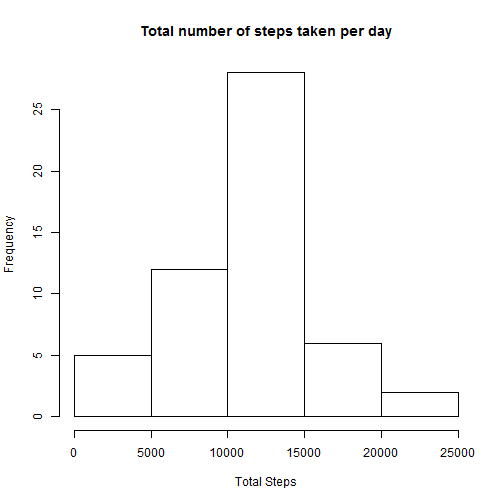
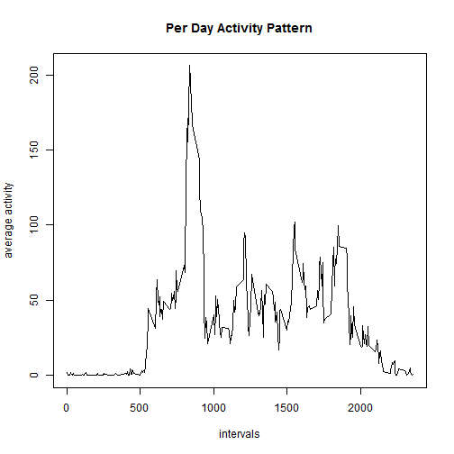
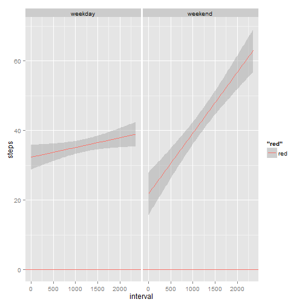

## Loading and preprocessing the data

The following code loads the data in R then converts the date column into a date variable


```r
activity <- read.csv("~/Rprogramming/Reproducible/activity/activity.csv",stringsAsFactors=FALSE)
activity$date <- as.Date(activity$date)
```
## What is mean total number of steps taken per day?

I use the dplyr package here in order to use the group_by and summarize functions. 

```r
library(dplyr)
```

```
## Warning: package 'dplyr' was built under R version 3.1.2
```

```
## 
## Attaching package: 'dplyr'
## 
## The following object is masked from 'package:stats':
## 
##     filter
## 
## The following objects are masked from 'package:base':
## 
##     intersect, setdiff, setequal, union
```

Next I create a variable "ignore_activity" which consists of all the interval information which is not NA. I also group them by date for later processing. 


```r
ignore_NA_activity <- activity[which(activity$steps != "NA"),]
ignore_NA_activity <- group_by(ignore_activity,date)
```

The code first summarises the total steps (sum() funtion), per day as the data.frame is grouped by day. 

```r
sum1 <- summarise(ignore_activity, sum(steps))
hist(sum1$"sum(steps)",xlab = "Total Steps", main ="Total number of steps taken per day")
```

 

```r
meanActvity <- mean(sum1$"sum(steps)")
medianActivity <- median(sum1$"sum(steps)")   
```

The calculated mean : 1.0766189 &times; 10<sup>4</sup>  
The calculated median : 10765
  
  
## What is the average daily activity pattern?

To get the averge daily activity I used the following code:


```r
sum_average_active <- activity[which(activity$steps != "NA"),]
sum_average_active <- group_by(sum_average_active,interval)
sum_average_active <- summarize(sum_average_active,mean(steps))
head(sum_average_active)
```

```
## Source: local data frame [6 x 2]
## 
##   interval mean(steps)
## 1        0   1.7169811
## 2        5   0.3396226
## 3       10   0.1320755
## 4       15   0.1509434
## 5       20   0.0754717
## 6       25   2.0943396
```

To get the pattern I graphed the results of the above graph. 

On the y-axis you you what the average steps are giving with the above code. 
On the x-axis you have the time period over which the dataset spans. 


```r
colnames(sum_average_active) <- c("interval","steps")
plot(sum_average_active,type = "l",xlab="intervals", ylab="average activity",
     main = "Per Day Activity Pattern")
```

 

Question: Which 5-minute interval, on average across all the days in the dataset, contains the maximum number of steps? 


```r
sum_average_active$interval[which.max(sum_average_active$steps)]
```

```
## [1] 835
```

## Imputing missing values
1.To determine how many rows have NA values I will use a basic subsetting technique and the is.na(). 
This will report True to all values in the 1st colomn of the activity date.frame where the NA values appear.  
Then by using the length() it will return the length, i.e. the number of NA in the data set.

```r
length(activity[is.na(activity),1])
```

```
## [1] 2304
```
2.To fill all the missing NA values I will take the averages of all the intervals, then place the average in the missing data corresponding to that interval for that day. 

Said another way: I will group the data by interval then using summarise() with the mean() to calculate all the avergae values for steps on a given interval. Then place the average values of interval into all intervals that are missing steps data. 

Here is the code:  

```r
interval_activity <- group_by(activity[!(is.na(activity$steps)),],interval)
missingAve <- summarise(interval_activity,round(mean(steps),digits=0))
colnames( missingAve) <-c("interval","steps")  
```

3.
To update the data with the average steps I wrote the following function:
Takes the "old" data (with missing steps value) and the new data set with the computed average data. Using a for loop cycles true the entire data set, using the if statement to select the NA value and update them. 


```r
head(activity)
```

```
##   steps       date interval
## 1    NA 2012-10-01        0
## 2    NA 2012-10-01        5
## 3    NA 2012-10-01       10
## 4    NA 2012-10-01       15
## 5    NA 2012-10-01       20
## 6    NA 2012-10-01       25
```

```r
hup <- function(old,miss_ave)
{
  for (n in 1:length(old$interval))
    {
      if(is.na(old[n,]$steps))
      { 
        old[n,]$steps <- miss_ave[miss_ave$interval==old[n,]$interval,]$steps
      }
    }
old
}
activity <- hup(activity,missingAve) 
head(activity)
```

```
##   steps       date interval
## 1     2 2012-10-01        0
## 2     0 2012-10-01        5
## 3     0 2012-10-01       10
## 4     0 2012-10-01       15
## 5     0 2012-10-01       20
## 6     2 2012-10-01       25
```

```r
meanAct_ave <- mean(activity$steps)
medianAct_ave <- median(activity$steps)
```

The calculated mean : 37.3806922  
The calculated median : 0

## Are there differences in activity patterns between weekdays and weekends?

To see if there is a difference in activity during the week and weekedn, I created another fucntion that adds a factor to the activity data.frame where it distinguishes if the data was read on a weekday or the weekend. 

```r
hup2 <- function(dayStatus)
{ status <- rep(NA,17568)
    for (n in 1:17568)
    {
        if(weekdays(dayStatus[n,"date"])=="Saturday" | weekdays(dayStatus[n,"date"])=="Sunday")
        {
          status[n] <- "weekend"           
        } else {
          status[n] <- "weekday"            
        }
         
    }
   status <- as.factor(status)
}

activity$day <- hup2(activity)
head(activity)
```

```
##   steps       date interval     day
## 1     2 2012-10-01        0 weekday
## 2     0 2012-10-01        5 weekday
## 3     0 2012-10-01       10 weekday
## 4     0 2012-10-01       15 weekday
## 5     0 2012-10-01       20 weekday
## 6     2 2012-10-01       25 weekday
```

Below I graph the data set using the ggplot2 library. Since the new column data is of data type factor, I use facets to seperate the data in the data set. 


```r
library(ggplot2)
qplot(interval, steps,data=activity,facets = .~ day, color="red" , geom = c("hline","smooth"),method="lm" )
```

 
